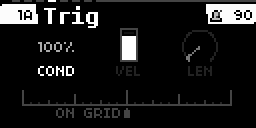
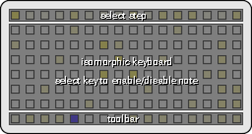

# gridstep
**gridstep** is a polyphonic, isomorphic grid keyboard sequencer for monome norns + grid using the timber engine. 

### requirements

* **norns**
* **grid 128 or 64** - note input and sequencing
* **timber** - for internal sounds. install from maiden

### optional

* **external midi devices** - for getting more sounds than just Molly The Poly

### features

* The grid can be played in an isomorphic layout that is either chromatic or in-scale. 
* It can sequence up to 16 tracks. 
* 16 sounds can be loaded into the Timber engine. 
* Sequences are stored as grid positions rather than notes and can be recorded from the grid input or programmed in.
* Each track can send it's notes to the internal sound engine (Molly The Poly) or to any midi channel or device. 
* Each track can have up to 16 patterns that can be quickly changed individually or as scenes.
* Each pattern can have up to 16 bars and the length of a bar can be set between 1 step to 16 steps. By mixing up bar lengths, you can create interesting polyrhythms! 
* Each step can have trigger conditions to create dynamic patterns!
* Each step can have a different velocities and note lengths.
* Each step can be offset +- 12 substeps or 16 substeps if the pattern is in triplet mode.
* The entire project can be saved and projects can be loaded during playback.

### doc

documentation for **gridstep** can be found [here](doc/README.md).

### changelog
**v1.2.3** - Added beat synced delay based on halfsecond from awake.

**v1.2.1** - Changed the sound engine to Timber. No UI yet, use the params menu to change sounds. There are 16 sound slots which are currently mapped to a track's midi channel parameter. 

**v1.1.1** - Bug fix to prevent too many of the same note from triggering at once which can crash Molly The Poly

**v1.1.0** - Added support for 64 / 8x8 grids. 

- works mostly the same as for 128 grids. 
- in 64 grid mode, keys 7 and 8 on the toolbar(y = 8) can be used to select steps 1-8 or steps 9-16 for editing. 
- use key 3 to round robin through the grid pages: play, pattern launch, sequence. 
- cut, copy, and paste have been moved to keys 4,5,6
- in grid play and grid sequence keys 7 and 8 on row 7 can be used to scroll up and down
- in grid pattern launch mode use shift + 5 and 6 to scroll the pattern view up and down. 
- All the shortcuts for the 128 mode are unchanged. 

**v1.0.1** - fixed bug that could occur when changing the number of bars in a pattern.

**v1.0.1** - initial release

