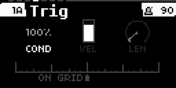
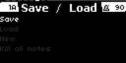
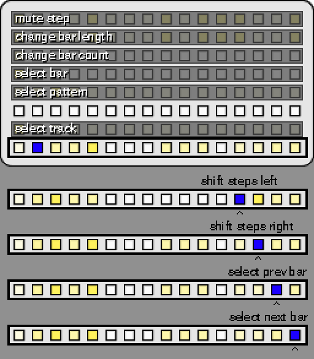

# gridstep
**gridstep** is a polyphonic, isomorphic grid keyboard sequencer for monome norns + grid. 

### requirements:

* **norns**
* **grid** - note input and sequencing

### optional:

* **external midi devices** - for getting more sounds than just Molly The Poly

### features

* The grid can be played in an isomorphic layout that is either chromatic or in-scale. 
* It can sequence up to 16 tracks. 
* Sequences are stored as grid positions rather than notes and can be recorded from the grid input or programmed in.
* Each track can send it's notes to the internal sound engine (Molly The Poly) or to any midi channel or device. 
* Each track can have up to 16 patterns that can be quickly changed individually or as scenes.
* Each pattern can have up to 16 bars and the length of a bar can be set between 1 step to 16 steps. By mixing up bar lengths, you can create interesting polyrhythms! 
* Each step can have trigger conditions to create dynamic patterns!
* Each step can have a different velocities and note lengths.
* Each step can be offset +- 12 substeps or 16 substeps if the pattern is in triplet mode.
* The entire project can be saved and projects can be loaded during playback.

## interface

The gridstep UI consists of several pages of parameters and several different grid editing modes. 

The UI pages share a common interface.

| control | function                                                     |
| ------- | ------------------------------------------------------------ |
| ENC1    | change the currently selected page                           |
| ENC2    | change the currently selected parameter                      |
| ENC3    | modify the value of the currently selected parameter         |
| K2      | back or hold for shift                                       |
| K3      | click on the currently selected parameter. if no value is shown for a parameter it can probably be clicked |

The page header shows the currently selected track and pattern on the left and the BPM on the right. 

## scale page

This page allows you to change the scale and root note for the project. You can also change the grid layout mode for the current track. Scale and root changes affect the entire project. Grid layout mode changes only affect the current track. The grid layout mode can be either chromatic or in-scale. If the layout mode is chromatic, changing the root and scale will not change the notes that are output so it is a good mode to use when sequencing drums. 

## sound page

The sound page allows you to change the sound of the internal Molly The Polly sound engine. Select a parameter using ENC2 then use K3 to generate a random lead, pad, or percussive sound.

## page clock

The clock page lets you can the midi sync source and the BPM. 

## page track

The track page allows you to change settings about the current track. The most useful parameters are "Sound Source", "Midi Channel", and "Midi Device". The other parameters can easily be changed using the grid. 

## page trig

This page will temporarily pop up when holding a step but can also be set to always be active. Here you can change the currently selected step's trig condition, velocity, length, and time offset. 

## page step time

This page will allow you to change the currently selected step's time offset in 1/128T intervals. If the value is fully right it will be offset by 1/16th and play on the next step. If the value is half way it will be offset by 1/32. 

Hold K2 while turning ENC3 to snap the value to the 1/64th intervals. 

Press K3 to change the pattern's offset mode to triplets. In triplet mode each step in a bar will be offset by 1/8T instead of 1/16th, so 3 notes per beat instead of 4 notes per beat. You may also wish to set the bar length to 12 to sync with a standard 16 step bar. 

## page save / load

Here you can save or load your project, create a new project or kill all the notes if shit goes south. Creating a new project will clear everything and stop playback. Loading a project can be done without stopping playback. 

## isomorphic keyboard

The heart of gridstep is the isomorphic keyboard. Notes are laid out in an isometric fashion meaning each row of notes is shifted right either by 5 or 7 steps depending on the active layout mode. 

#### in scale mode

If the layout mode is in scale then every key on the keyboard will be in the selected scale. Keys that are root notes are brightly lit. In this mode you can play up and down the scale easily by playing 3 notes on the x axis and then moving up on the y axis and playing 3 notes in the same x positions. 

A pattern that is sequenced in this mode will trigger different notes if the scale or root note is changed. 

#### chromatic mode

The chromatic layout mode allows you to play every note. Notes that are in scale will be lit. The root notes will be brightly lit. Unlit notes are not in the current scale. 

If a pattern is sequenced in this mode and the scale or root note is changed, the pattern will still play the same notes, the keys that are lit will change. Therefore it is useful when sequencing drum machines. 

## grid toolbar

The toolbar is on the bottom row of keys and shares a number of common attributes between modes. 

Use key 1 to start or stop playback. 

Use key 2 to activate shift. 

Use shift(Key 2) and Play(Key 1) to enable recording.

Keys 3,4, & 5 change the grid mode between play, pattern launch, and sequence edit.

Key 16 moves the isomorphic keyboard up a row to access higher octaves.

Key 15 moves the isomorphic keyboard down a row to access lower octaves. 

Each track stores it's own vertical offset.

## grid shift

holding the shift key will temporarily change the grid page. 

Shift + Row 1 is used to mute steps.

Shift + Row 2 changes the length of steps in a bar

Shift + Row 3 changes the number of bars in a pattern

Shift + Row 4 changes the selected bar. 

Shift + Row 5 changes the selected pattern. If playback is active, the newly selected pattern will start playing once the previous pattern reaches the end of it's bar. 

Shift + Row 7 changes the selected track.

Shift + Key 13 on the toolbar will move all the notes in a pattern left by 1 step. 

Shift + Key 14 on the toolbar will move all the notes in a pattern right by 1 step. 

Shift + Key 15 on the toolbar will select the previous bar in the pattern.

Shift + Key 16 on the toolbar will select the next bar in the pattern.

## grid cut / copy / paste

If these three keys are lit on a page, you can use them to cut(key 9), copy(key 10), or paste(key 11) data.

In step edit mode, a page similar to the shift page will be shown. 

Hold the cut key, then press a step, bar or pattern containing notes to cut it. Pressing again on a empty step, bar or pattern will perform a paste. This is very useful for moving steps around and experimenting.

Hold the copy key, then press a step, bar or pattern containing notes to copy it. Pressing again on a empty step, bar or pattern will perform a paste. 

Hold the paste key then select a step, bar or pattern to paste. Even if a step, bar or pattern has notes, it will be overwritten with the contents of the clipboard. 

Cut, copy & paste work on the sequencer page and the pattern launch page. On the pattern launch page, the page will not change while holding cut, copy or paste. Instead the keys will work to cut, copy, and paste patterns or tracks. When copying a track on the pattern launch page, it can only be pasted using the paste key. When cutting a track on the pattern launch page, the track settings will be copied instead. 

## grid play

Grid play is the default mode that gridstep starts in and can be accessed by pressing key 3 on the toolbar. This page allows you to play the isomorphic keyboard on the currently selected track, and also record notes in to the current pattern. 

When recording, notes will be automatically offset to match when they were pressed. Step lengths will also be set based on how long a note was held. If the pattern loops and the notes overlap a step that already has notes, the new notes will be added to the step and the step's offset and length will stay the same. 

Key 13 on the toolbar will change the isomorphic layout mode between chromatic and in-scale.

Key 14 on the toolbar enables dark mode for the isomorphic keyboard, meaning that the in-scale and root note keys will not be lit. Try enabling dark mode while playing back a sequence for an enjoyable light show!

## grid pattern launch

This mode allows you to quickly change the selected track and pattern. Patterns that are actively playing will flash. Patterns with notes in them will be lit and patterns that are selected will be brightly lit. Switching the selected pattern while playback is active will queue the pattern to play on the next bar.

Patterns can be quickly copied by holding a pattern then pressing another pattern slot. 

Tracks can be muted by holding the shift key and then pressing a track. Muted tracks will not trigger notes and will not be lit. 

An entire row of patterns can be selected by holding shift and then pressing a row. Using this you can structure a song as different parts in each row and then advance to another part by shift selecting a new row. 

Cut, copy, and paste will work on patterns. For cut and copy, a paste will be performed when selecting an empty pattern.

Cutting a track copies the track's settings such as "Sound Source", "Midi Channel", & "Midi Device". Paste will need to be used to paste the settings. 

Copying a track copies all the track's patterns and mute state but not the settings. Paste will need to be used to paste the patterns. Pasting will replace any existing patterns on the track.

## grid sequencer

The sequencer allows you to edit the notes of each bar of a pattern. A bar can be up to 16 steps in length. 

The top row shows the steps. Steps with notes in them will be lit and the currently selected step will be brightly lit. 

The notes for each step will be lit on the isomorphic keyboard. 

Holding a step and selecting another step will copy the first selected step into the second step, overwriting the second step. 

The right 2 columns of the isomorphic keyboard section display the steps velocity and note length which can be easily changed.

Holding a step will change the keyboard view into a time offset view. The trig page will also be displayed on the norn's screen. The offset can be quickly changed by pushing a key.

#### edit velocities

When in sequencing mode, hold shift and press key 3 on the toolbar to edit velocities. Press key 1 or key 3 to return to the main sequencer. Press key 4 to change to the note length editor.

#### editing note lengths

When in sequencing mode, hold shift and press key 4 on the toolbar to edit note lengths. Press key 1 or key 4 to return to the main sequencer. Press key 3 to change to the velocity editor editor.

## trig conditions

A steps trig condition can be changed in the trig page. 

Scrolling ENC3 counter clockwise will set the trig to be randomly triggered based on a percentage.  

Scrolling clockwise past 100% provides several options:

* **Pre** - step will trigger if the previously evaluated trig condition was true. Prior steps that are set to 100% will have no effect.
* **!Pre** - step will not trigger if the previously evaluated trig condition was true. Prior steps that are set to 100% will have no effect.
* **First** - step will trigger the first time a pattern plays. The step will not trigger during sequential loops of the pattern.
* **!First** - step will not trigger the first time a pattern plays. The step will trigger during sequential loops of the pattern.
* **X:Y** - step will trigger on a counter that fires when the number of pattern loops reaches X. The counter is reset on Y number of steps. If set to 1:2 the step will trigger the first time a pattern plays, not the second time, and then trigger again the third time and so on. 
