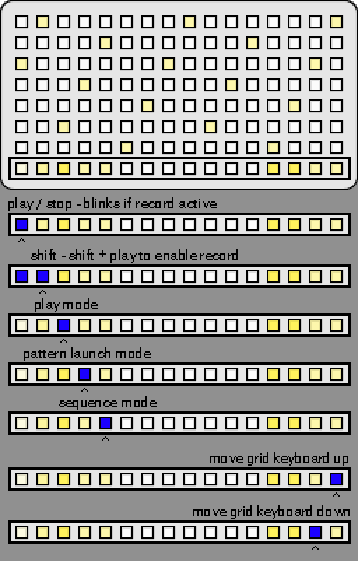
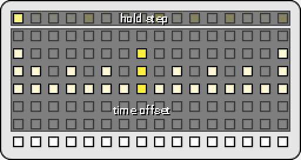

# gridstep
gridstep is a polyphonic, isomorphic grid keyboard sequencer for monome norns + grid. 

**Requirements:**

* **norns**
* **grid** - note input and sequencing

**Optional:**

* **external midi devices** - for getting more sounds than just Molly The Poly

## features

* The grid can be played in an isomorphic layout that is either chromatic or in-scale. 
* It can sequence up to 16 tracks. 
* Sequences are stored as grid positions rather than notes and can be recorded from the grid input or programmed in.
* Each track can send it's notes to the internal sound engine (Molly The Poly) or to any midi channel or device. 
* Each track can have up to 16 patterns that can be quickly changed individually or as scenes.
* Each pattern can have up to 16 bars and the length of a bar can be set between 1 step to 16 steps. By mixing up bar lengths, you can create interesting polyrhythms! 
* Each step can have trigger conditions to create dynamic patterns!
* Each step can have a different velocities and note lengths.
* Each step can be offset +- 12 substeps or 16 substeps if the pattern is in triplet mode.
* The entire project can be saved and projects can be loaded during playback.

## interface

The gridstep UI consists of several pages of parameters and several different grid editing modes. 

The UI pages share a common interface.

| control | function                                                     |
| ------- | ------------------------------------------------------------ |
| ENC1    | change the currently selected page                           |
| ENC2    | change the currently selected parameter                      |
| ENC3    | modify the value of the currently selected parameter         |
| K2      | back or hold for shift                                       |
| K3      | click on the currently selected parameter. if no value is shown for a parameter it can probably be clicked |

The page header shows the currently selected track and pattern on the left and the BPM on the right. 

## scale page

This page allows you to change the scale and root note for the project. You can also change the grid layout mode for the current track. Scale and root changes affect the entire project. Grid layout mode changes only affect the current track. The grid layout mode can be either chromatic or in-scale. If the layout mode is chromatic, changing the root and scale will not change the notes that are output so it is a good mode to use when sequencing drums. 

## sound page

The sound page allows you to change the sound of the internal Molly The Polly sound engine. Select a parameter using ENC2 then use K3 to generate a random lead, pad, or percussive sound.

## page clock

The clock page lets you can the midi sync source and the BPM. 

## page track

The track page allows you to change settings about the current track. The most useful parameters are "Sound Source", "Midi Channel", and "Midi Device". The other parameters can easily be changed using the grid. 

## page trig

This page will temporarily pop up when holding a step but can also be set to always be active. Here you can change the currently selected step's trig condition, velocity, length, and time offset. 

## page step time

This page will allow you to change the currently selected step's time offset in 1/128T intervals. If the value is fully right it will be offset by 1/16th and play on the next step. If the value is half way it will be offset by 1/32. 

Hold K2 while turning ENC3 to snap the value to the 1/64th intervals. 

Press K3 to change the pattern's offset mode to triplets. In triplet mode each step in a bar will be offset by 1/8T instead of 1/16th, so 3 notes per beat instead of 4 notes per beat. You may also wish to set the bar length to 12 to sync with a standard 16 step bar. 

## page save / load

Here you can save or load your project, create a new project or kill all the notes if shit goes south. Creating a new project will clear everything and stop playback. Loading a project can be done without stopping playback. 

## isomorphic keyboard

**in scale mode**

**chromatic mode**

## grid toolbar

## grid shift

## grid cut / copy / paste

## grid play

The grid starts in this mode. Rows 1 - 7 act as a isomorphic keyboard. The highlighted keys represents the root note. 

## grid clip launch

## grid sequencer

## trig conditions

A steps trig condition can be changed in the trig page. 

Scrolling ENC3 counter clockwise will set the trig to be randomly triggered based on a percentage.  

Scrolling clockwise past 100% provides several options:

* **Pre** - step will trigger if the previously evaluated trig condition was true. Prior steps that are set to 100% will have no effect.
* **!Pre** - step will not trigger if the previously evaluated trig condition was true. Prior steps that are set to 100% will have no effect.
* **First** - step will trigger the first time a pattern plays. The step will not trigger during sequential loops of the pattern.
* **!First** - step will not trigger the first time a pattern plays. The step will trigger during sequential loops of the pattern.
* **X:Y** - step will trigger on a counter that fires when the number of pattern loops reaches X. The counter is reset on Y number of steps. If set to 1:2 the step will trigger the first time a pattern plays, not the second time, and then trigger again the third time and so on. 

